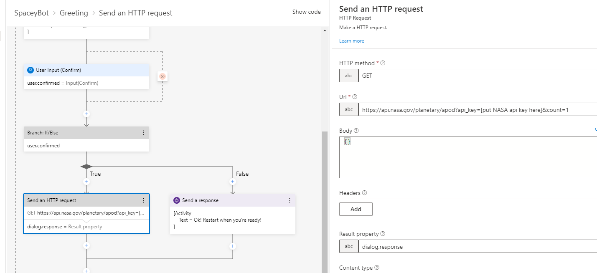
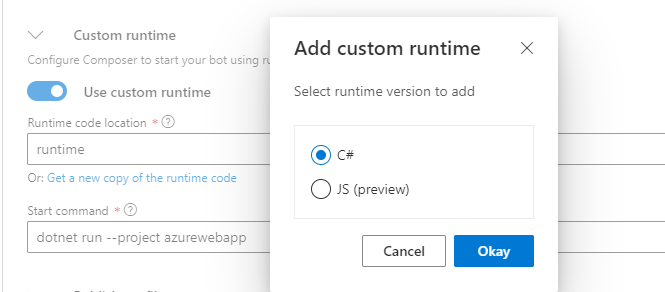
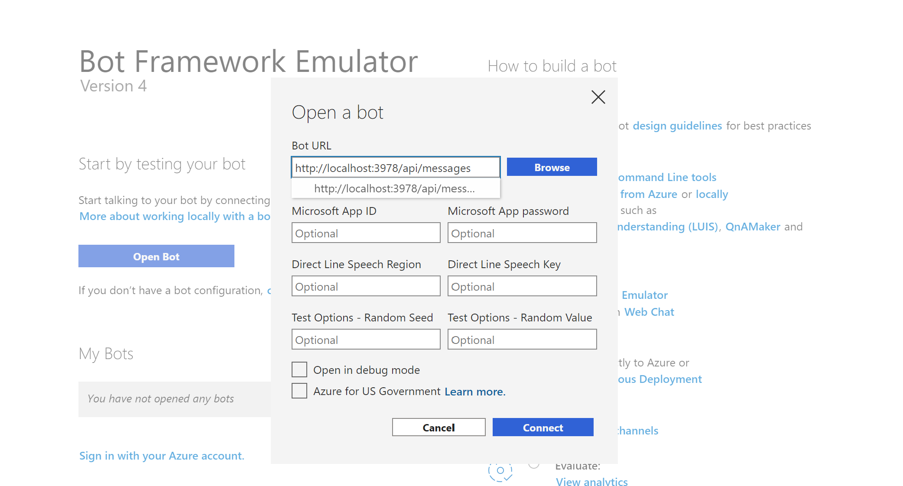

# SpaceyBot

A bot built with the Bot Framework Composer.

❗[Building with the SDK? Check out this bot sample!](https://github.com/paladique/AzureSample-HTTPBot)

## What it does

Prompts the user and displays a random image from NASA's [Astronomy Picture of the Day](https://github.com/nasa/apod-api) open API. Options in Bot Framework Composer have generated this bot in C#.

## Instructions

1. Install the [Bot Framework Composer](https://docs.microsoft.com/composer/install-composer?WT.mc_id=academic-0000-jasmineg)
1. Clone/download this repo.
1. Open the Bot Framework Composer, select "Open" and open the folder you cloned/downloaded.
1. Go to the [NASA API Site](https://api.nasa.gov/) and fill out the form to receive an API key to your email.
1. Replace the api key placeholder with the NASA api key that has been generated for you.
    - 

1. Select "Start Bot" at the top right of the composer. You can test the bot in the Composer with web chat, or install and use the [Bot Emulator](https://github.com/microsoft/botframework-emulator) to test it.
    -  

## Running the code

Options in Bot Framework Composer have generated this bot in C# and can be ran and tested with the [Bot Emulator](https://github.com/microsoft/botframework-emulator).

1. Open this cloned/downloaded folder in VS Code
    1. Or you can navigate to the folder in your favorite command line tool
1. Install the [Bot Emulator](https://github.com/microsoft/botframework-emulator).
1. Open the terminal and run the following command:
    `dotnet run --project .\azuresample_spaceybot.csproj`
1. If you see a few status messages in your terminal, the bot is running successfully!
1. Make note of this message and copy the link: ` Now listening on: http://localhost:####`  (`####` will be a set of 4 numbers)
1. Open the Bot Emulator, select "Open Bot" and paste the copied link from the last step into the "Bot URL" text box
1. Add `/api/messages` to the end of the pasted link so it reads:  `http://localhost:####/api/messages`
1. Select `Connect` to start the bot

*Refer to [this documentation](https://docs.microsoft.com/azure/bot-service/bot-service-debug-emulator?view=azure-bot-service-4.0&tabs=csharp&WT.mc_id=academic-0000-jasmineg) if you are feeling lost!*

## Read more

- [Bot Framework Composer Documentation](https://docs.microsoft.com/composer/?WT.mc_id=academic-0000-jasmineg)
- Microsoft Learn: [Create conversational AI Solutions](https://docs.microsoft.com/learn/paths/create-conversational-ai-solutions?WT.mc_id=academic-0000-jasmineg)
